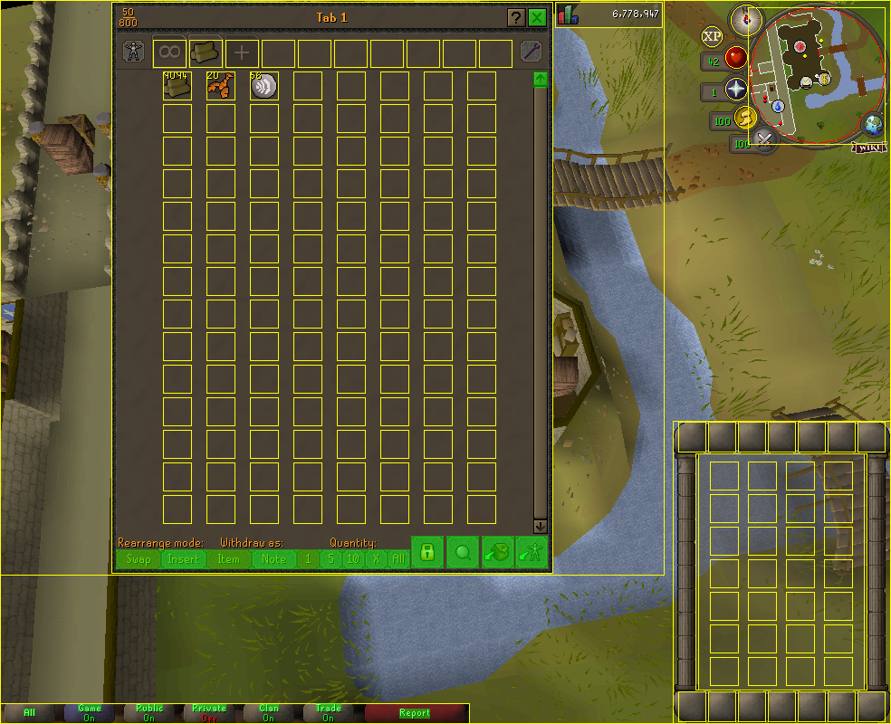
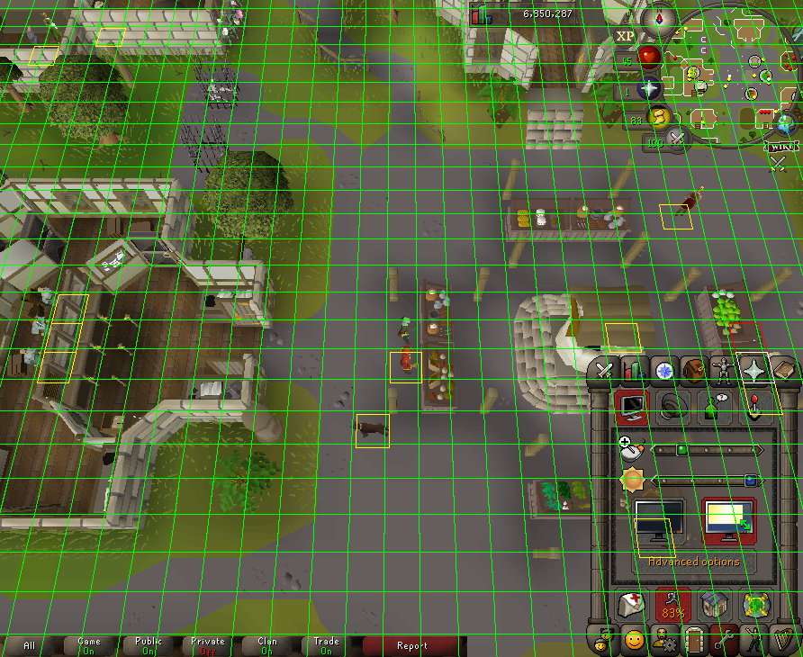
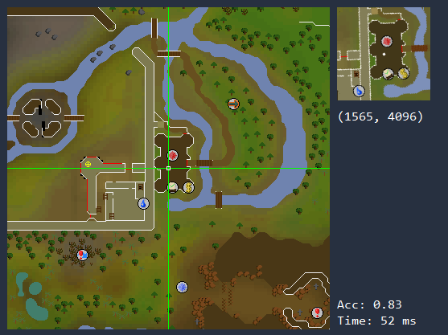

SRL Resource Library
=====================
SRL is a library that provides an API for writing bots in Simba for the game Old School RuneScape.

Documentation is available [here](https://villavu.github.io/SRL-Development)

## Features

\
*Resizable mode*

\
*Minimap to mainscreen projection*

\
*Detecting position on the world map*

\
*Web walking system (does not handle obstacles)*
