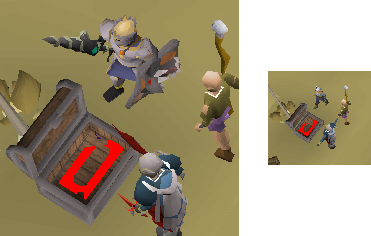
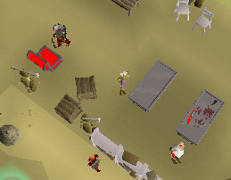
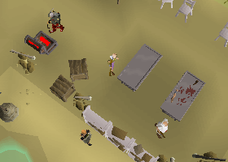
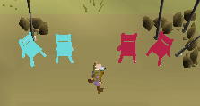
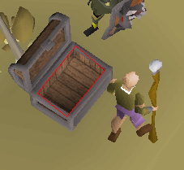

TRSObjectFinder
=====

`TRSObjectFinder.Zoom` must be set to the zoom which this finder was created at. This allows the finder to work at any zoom level. For example `10` pixels at `50` zoom is equivalent to `~30` pixels when fully zoomed in, SRL has `MainScreen.TranslateDistance` to calculate this for us.



The same finder working at two different zoom levels.

---

`TRSObjectFinder.Colors` is a color array to be searched for which will be merged together:

```pascal
Finder.Colors += CTS2(2503237, 20, 0.10, 0.14); // brown
Finder.Colors += CTS2(5526875, 15, 0.19, 0.06); // grey
```


The two colors merged together.

---

`TRSObjectFinder.ColorClusters` is an array of color clusters to be merged together.

A color cluster consists of a `primary` and `secondary` color, which when searched only `primary` colors within `x` distance of `secondary` colors are returned.

```pascal
Finder.ColorClusters += [
  CTS2(2503237, 20, 0.10, 0.14), // brown
  CTS2(5526875, 15, 0.19, 0.06), // grey
  2								 // distance			
];                        
```


Primary color (brown) within distance (2) of secondary color (grey)

---

`TRSObjectFinder.Erode`

The amount to erode before clustering. This is useful for removing noise.

```pascal
Finder.Erode := 2;
```

Before:


After:


---

`TRSObjectFinder.ClusterDistance`

The distance to pass to `ClusterTPA`, this is how we split up multiple objects. `Distance=5` would mean that points that are closer than or equal to 5 pixels away are considered close enough to merge into a singular group.

No clustering:


`ClusterDistance=5` Four Individual chairs


`ClusterDistance=20` Two sets of chars


---

```
TRSObjectFinder.MinLongSide 
TRSObjectFinder.MaxLongSide
TRSObjectFinder.MinShortSide 
TRSObjectFinder.MaxShortSide
```

These are the size limits that can be set, any match that exceeds these will be removed. The bounding rectangle is found which has a long and a short side measured in pixels.

Without any size limits:


With size limits:
```
Finder.MinShortSide := 10;
Finder.MaxShortSide := 100;
Finder.MinLongSide := 10;
Finder.MaxLongSide := 100; 
```




